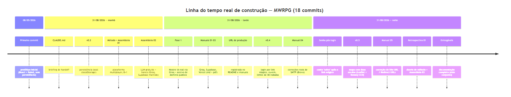
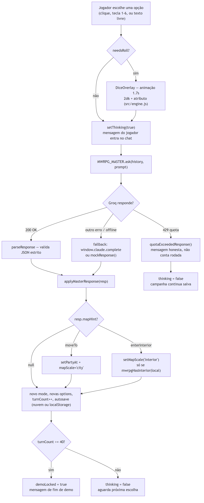
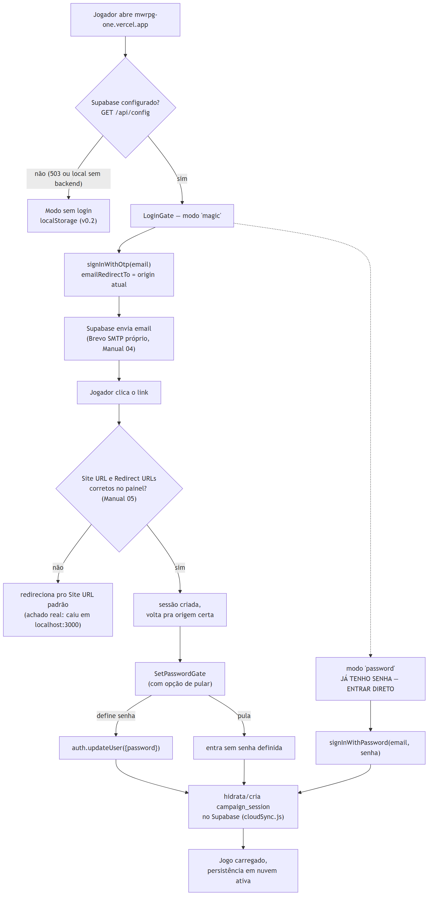
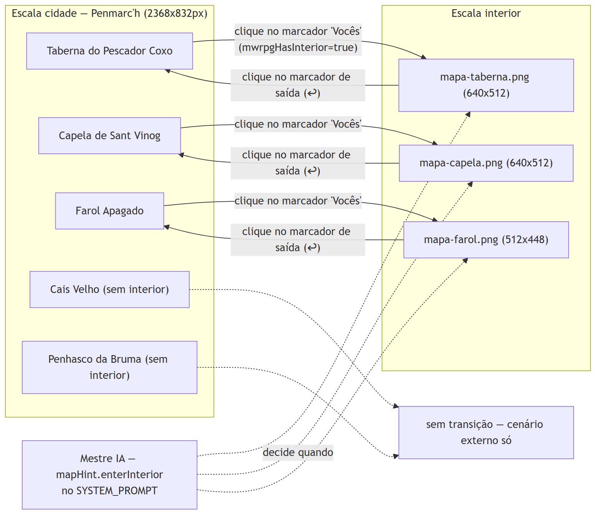
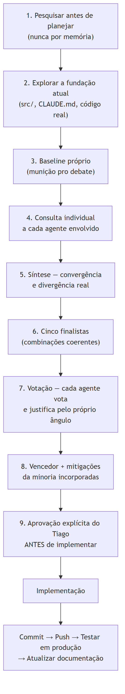

# 1. Introdução

Este é o primeiro de 11 documentos que registram o MWRPG como ele
**existe hoje**, verificado diretamente contra o código-fonte real e o
histórico de commits — não contra o que foi planejado e depois mudou de
rumo. Onde uma etapa foi abandonada no meio do caminho (o caso mais
importante: o escopo de sala multiplayer aprovado na Assembleia 01),
isso está registrado como decisão, com o motivo, no Documento 07 — não
omitido aqui.

O foco deste documento é **lógico e processual**: como cada mecanismo
funciona como fluxo, em diagramas Mermaid renderizados. O modelo de
dados propriamente dito está no Documento 02. A arquitetura de
componentes e infraestrutura está no Documento 05.

## 1.1 Como este documento foi produzido

Todo fato técnico citado abaixo foi extraído do código real em
`C:\Users\Tiago\Desktop\Projetos\RPGForFun\MWRPG` em 31/08/2026: contagem
de commits e datas vêm de `git log`; contagem de linhas vem de `wc -l`
sobre cada arquivo citado; nomes de função e constantes vêm de leitura
direta de `src/app.jsx`, `src/master.js`, `src/auth.js`, `src/maps.js` e
`api/master.js` — não de memória de conversas anteriores.

# 2. Linha do tempo real de construção

O projeto tem **18 commits** no total, mas a distribuição real é
desigual: o primeiro commit (protótipo inicial, sem persistência) é de
**08/05/2026**; todos os outros 17 commits — da persistência local até
esta própria série de documentação — aconteceram num único dia,
**31/08/2026**. Não houve um "dia 2" de desenvolvimento: o projeto ficou
parado por quase quatro meses entre o protótipo e a retomada.

*Figura 1 — Linha do tempo de construção, por fase, dentro do dia 31/08/2026.*

# 3. Fluxo de um turno de jogo

O núcleo funcional do MWRPG é o ciclo de turno: o jogador escolhe uma
ação (clique numa opção, tecla 1–6, ou texto livre se
`tweaks.allowFreeText` estiver ligado), o sistema resolve rolagem de
dado quando `needsRoll` é verdadeiro (`src/engine.js`, 2d6 + atributo,
40 linhas), e o Mestre IA responde em JSON estrito.

*Figura 2 — Do clique do jogador à próxima escolha disponível — `src/app.jsx`, `src/master.js`.*

O encadeamento de fallback em `MWRPG_MASTER.ask()` (`src/master.js`,
205 linhas) tem três camadas, nesta ordem: **Groq** (produção real,
`api/master.js`) → **`window.claude.complete`** (só existe dentro do
artifact host da Anthropic) → **modo offline** (`mockResponse()`,
respostas guiadas sem IA nenhuma). Uma resposta `429` da Groq **não**
cai no fallback offline — vira `quotaExceededResponse()`, uma mensagem
honesta ("o mestre precisa de um instante de silêncio") que não conta
como rodada consumida, distinta do modo offline genérico. Essa
distinção existe porque um limite de cota estourado é uma condição
temporária e compartilhada (a Groq limita por organização inteira, não
por jogador — Documento 03, Seção 4), enquanto o modo offline é o
último recurso quando nenhum provedor de IA está disponível.

# 4. Fluxo de login e persistência em nuvem

O login segue o padrão "magic link primeiro, senha depois" — decidido
para reduzir atrito no primeiro contato (Documento 08, Seção 4). Quando
o Supabase não está configurado (`GET /api/config` retorna 503, ou o
jogo roda local sem backend), o sistema degrada graciosamente para o
`localStorage` da v0.2, sem travar ninguém.

*Figura 3 — Magic link, o achado real do redirect pra localhost, e a senha pós-confirmação.*

O ramo "Site URL e Redirect URLs incorretos" da Figura 3 não é
hipotético: é o bug real encontrado em produção em 31/08/2026, quando o
primeiro teste ponta a ponta do Tiago voltou apontando para
`http://localhost:3000` com `otp_expired`/`access_denied` na URL — a
causa raiz e a correção estão detalhadas no Documento 06, Seção 6, e no
`docs/MANUAL-05-URL-CONFIGURATION.md`.

# 5. Fluxo do mapa com duas escalas

O sistema de mapa (v0.5) usa Leaflet.js com `CRS.Simple` (mapas em
pixel, não geográficos) para alternar entre a escala de cidade
(Penmarc'h, 5 locais) e a escala de interior (3 dos 5 locais têm
interior desenhado). A transição é disparada por clique do jogador no
próprio marcador do mestre (se `mwrpgHasInterior(local)` for
verdadeiro) **ou** pelo Mestre IA, via `mapHint.enterInterior` no JSON
de resposta — a instrução explícita do Tiago de que "o próprio mestre
[deve] decidir onde e quando usar os lugares".

*Figura 4 — Cidade, os 3 interiores existentes, e os 2 locais que são só cenário externo.*

`docks` (Cais Velho) e `cliff` (Penhasco da Bruma) não têm interior por
decisão de escopo, não por lacuna — `src/master.js` → `SYSTEM_PROMPT`
instrui explicitamente o Mestre IA a nunca pedir `enterInterior` nesses
dois locais.

# 6. Fluxo do método de planejamento (assembleia multiagente)

Funcionalidade nova de porte relevante segue um processo de 9 passos
(`docs/METODO-PLANEJAMENTO.md`, adaptado do PushProcessos): baseline
próprio → consulta individual a cada agente do roster (10 arquivos em
`.claude/agents/`) → síntese de convergência/divergência → 5 finalistas
→ votação com objeção da minoria registrada → aprovação explícita do
Tiago antes de qualquer código.

*Figura 5 — Os 9 passos, incluindo o ciclo permanente commit→push→produção→documentação.*

**Achado real, registrado com honestidade** (Documento 07, Seção 5):
esse método foi seguido rigorosamente nas Assembleias 01 e 02, mas
**não** foi seguido entre a Assembleia 02 e a retomada em 31/08/2026 à
noite — login, senha pós-login, limite de demo, contador por campanha e
o sistema de mapa foram implementados direto, sem consulta individual
nem votação. A Retrospectiva 01 audita essas seis decisões; a
Assembleia 03 retoma o método por completo.

# 7. Referências

1. `git log --oneline` — 18 commits, executado em 31/08/2026.
2. `src/app.jsx` (381 linhas), `src/master.js` (205 linhas), `src/engine.js` (40 linhas) — lidos integralmente em 31/08/2026.
3. `src/maps.js` (54 linhas), `src/auth.js` (127 linhas) — lidos integralmente em 31/08/2026.
4. `docs/METODO-PLANEJAMENTO.md` — processo de 9 passos, registrado em 31/08/2026.
5. `docs/MANUAL-05-URL-CONFIGURATION.md` — achado real do redirect pra localhost, corrigido em 31/08/2026.
6. `docs/RETROSPECTIVA-01-DESVIO-DE-METODO.md` — auditoria do desvio de método, 31/08/2026.
