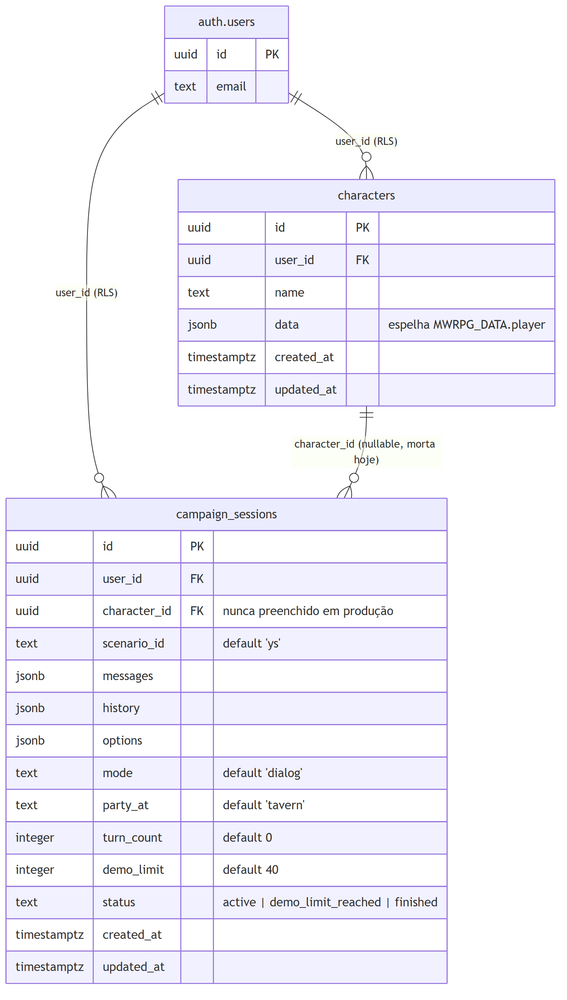
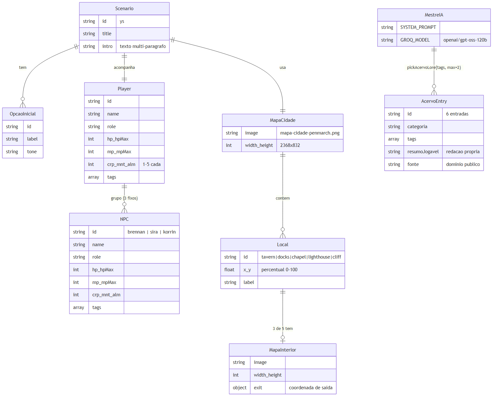

# 1. Introdução

Este documento descreve a **estrutura estática** dos dados do MWRPG —
tanto o que já é banco de verdade (Supabase Postgres) quanto o que
ainda é só estrutura de dados no navegador, sem persistência
relacional nenhuma. Essa distinção importa: o MWRPG de hoje é, na
prática, um jogo majoritariamente **client-side** com uma camada fina
de persistência em nuvem por cima — o inverso de um sistema
tradicional onde o banco é a fonte de verdade.

Todos os campos citados foram extraídos de `supabase/schema.sql` (64
linhas) e de `src/data.js` (59 linhas) em 31/08/2026 — leitura direta,
não de memória.

# 2. Banco de dados (Supabase Postgres)

*Figura 1 — `characters` e `campaign_sessions`, com `auth.users` do próprio Supabase Auth.*

Duas tabelas de aplicação, ambas com Row Level Security (`auth.uid() =
user_id`) — nenhum jogador enxerga dado de outro. `characters` tem um
gatilho (`set_updated_at`) compartilhado com `campaign_sessions` para
manter `updated_at` correto sem depender do cliente lembrar de setar.

## 2.1 Achado real: a tabela `characters` está morta

`characters` foi criada junto com `campaign_sessions` (mesma migração,
mesmo commit `feat: v0.4`), com `user_id`, `name` e `data jsonb`
(espelhando o formato de `MWRPG_DATA.player`) — mas **nunca foi
referenciada em nenhum arquivo de `src/`** (confirmado por busca no
código antes de escrever este documento, comando `grep -r "characters"
src/`, zero resultados). O jogador de hoje continua usando a ficha
fixa de `src/data.js`, não uma linha desta tabela.

Isso não é um bug de implementação — é rastro direto de uma decisão de
escopo que nunca foi formalizada: a Assembleia 01 (31/08/2026) aprovou
criação de personagem como item "não-negociável" do MVP; o schema foi
desenhado para isso; a feature em si nunca foi construída quando o
projeto pivotou pra "demo solo com login". Análise completa no
Documento 07, Seção 4, e na `docs/RETROSPECTIVA-01-DESVIO-DE-METODO.md`.

`campaign_sessions.character_id` existe e referencia `characters.id`,
mas pela mesma razão nunca é preenchido em produção — fica sempre
`null`.

# 3. Estruturas de dados no cliente (runtime, não banco)

A maior parte do "modelo de dados" real do jogo hoje vive em
`window.MWRPG_DATA` (`src/data.js`) e `window.MWRPG_MAPS`
(`src/maps.js`) — objetos JavaScript carregados na primeira tela,
sem tabela nem consulta nenhuma por trás. Quando uma campanha é salva
(local ou nuvem), é justamente uma cópia serializada dessas
estruturas — `messages`, `history`, `options`, `party_at` — que vira
uma linha em `campaign_sessions`.

*Figura 2 — Cenário, jogador, os 3 NPCs fixos, mapa, e o acervo narrativo.*

## 3.1 O grupo é fixo, não gerado

`Player` é um único objeto fixo (atributos CRP/MNT/ALM = 2/2/2, HP
14/14, MP 6/6) e os 3 `NPC` (Brennan, Sira, Korrin) também são
constantes de `data.js`, não instâncias geradas por um fluxo de
criação de personagem — reforça o achado da Seção 2.1: não existe hoje
nenhum caminho para o jogador criar ou customizar uma ficha.

## 3.2 `AcervoEntry` — 6 entradas, retrieval por tag

`src/acervo.js` (106 linhas) expõe 6 entradas de domínio público
(3 fábulas de Esopo, 2 mitos gregos clássicos, 1 folclore brasileiro),
cada uma com `tags` e um `resumoJogavel` de redação própria (nunca a
prosa original copiada — ver `docs/ACERVO-PROVENIENCIA.md`).
`pickAcervoLore(tags, max)` faz *matching* simples por sobreposição de
tag — sem embeddings, sem busca vetorial. O Mestre IA recebe até 2
entradas relevantes por turno como "material de referência", nunca
como obrigação de uso.

## 3.3 `Local` e `MapaInterior` — 5 locais, 3 interiores

`window.MWRPG_MAPS.city.markers` tem 5 locais (coordenadas em pixel,
não mais percentual — migração da v0.2 pro sistema Leaflet da v0.5);
só `tavern`, `chapel` e `lighthouse` têm uma entrada
`<id>_interior` correspondente. `mwrpgHasInterior(locationId)` é a
função que decide, em tempo real, se um clique no marcador "Vocês"
deve oferecer a transição.

# 4. Referências

1. `supabase/schema.sql` — 64 linhas, lido integralmente em 31/08/2026.
2. `src/data.js` — 59 linhas, lido integralmente em 31/08/2026.
3. `src/maps.js` — 54 linhas, lido integralmente em 31/08/2026.
4. `src/acervo.js` — 106 linhas, lido integralmente em 31/08/2026.
5. Busca `grep -r "characters" src/` — zero resultados, confirmando a tabela morta (Seção 2.1), 31/08/2026.
6. `docs/RETROSPECTIVA-01-DESVIO-DE-METODO.md` — análise completa do desvio de escopo.
