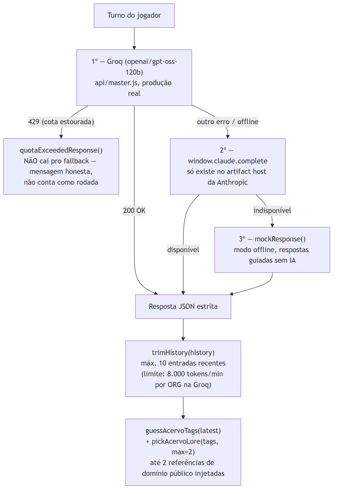

# 1. Introdução

Este documento cataloga as **técnicas concretas** aplicadas para resolver
cada problema do MWRPG — o que foi usado e como. A fundamentação teórica
de por que cada técnica funciona está no Documento 08, para não repetir o
mesmo conteúdo com ângulos diferentes.

# 2. Sistema de regras: "D6 das Três Letras"

**Problema**: resolver ações incertas com um sistema simples de aprender
(o jogador não precisa consultar tabela nenhuma), rápido de rolar, e com
graus de sucesso — não um binário passa/falha.

**Técnica** (`src/engine.js`, 40 linhas): 2d6 + um dos três atributos
(CRP/MNT/ALM, 1 a 5), somados em 4 bandas — 6 ou menos falha narrativa,
7–9 sucesso parcial, 10–12 sucesso pleno, 13 ou mais crítico. A curva de
2d6 (distribuição triangular, não uniforme) concentra resultados no meio
— torna "sucesso parcial" o desfecho mais comum, o que casa com o tom
narrativo do jogo (raramente falha total ou vitória total). O atributo
certo é inferido de uma tag textual mandada pelo próprio Mestre IA
(`attrFromTag`, três expressões regulares por atributo) quando o
front-end não especifica um `attr` explícito na opção.

Combate usa 6 ações fixas com glyph Unicode próprio (nunca emoji, regra
de design registrada em `CLAUDE.md` §14, glyphs citados por nome aqui —
não pela fonte padrão do gerador de PDF, ver Documento 04, Seção 3.3):
Atacar (espada cruzada, CRP), Magia (estrela de quatro pontas, ALM),
Item (intersecção elétrica, sem atributo), Mover (seta em laço, CRP),
Defender (escudo, CRP), Falar (oposição astrológica, ALM).

# 3. Contrato JSON estrito com o Mestre IA

**Problema**: fazer um LLM narrar livremente, mas devolver dados
estruturados que a UI consegue renderizar sem parsing frágil de texto
livre — e trocar de provedor de LLM (Claude → Groq) sem quebrar o
frontend.

**Técnica**: `SYSTEM_PROMPT` (`src/master.js`) força resposta em JSON
puro, sem markdown, com campos fixos: `narration`, `mode`, `options[]`
(2 a 6, cada uma com `label`/`attr`/`needsRoll`), `rollResult`,
`mapHint` e `stateChanges`. O contrato é o mesmo independente do
provedor — a troca de Claude para Groq (Documento 07) não exigiu
nenhuma mudança no frontend, só no adaptador de request/response em
`api/master.js`.

## 3.1 Extensão aditiva: `mapHint.enterInterior`

Quando o sistema de mapa (v0.5) precisou que o mestre decidisse
transições cidade↔interior, o contrato ganhou um campo novo
(`enterInterior: true | false | null`) dentro de `mapHint` — uma
extensão aditiva, não uma mudança de campo existente. O prompt lista
explicitamente quais dos 5 locais têm interior (3) para o modelo nunca
pedir uma transição inválida.

# 4. Cascata de fallback do Mestre IA (3 camadas)

**Problema**: manter o jogo jogável mesmo se o provedor de IA principal
falhar, sem gastar orçamento de token à toa e sem confundir "cota
esgotada" (temporário, comum) com "sem IA disponível" (raro).

*Figura 1 — Groq → claude.complete → offline, com o desvio de cota estourada.*

Uma resposta `429` da Groq tem tratamento **deliberadamente diferente**
das outras falhas: vira `quotaExceededResponse()`, não avança pro
próximo nível do fallback. A justificativa é o próprio limite real da
Groq — 8.000 tokens/minuto e **200.000 tokens/dia por organização
inteira**, não por jogador (verificado na documentação da Groq, não por
memória — Assembleia 02). Cair silenciosamente pro modo offline nesse
caso esconderia do jogador que o motivo foi orçamento compartilhado, não
falta de conectividade.

`trimHistory()` limita o que é mandado a cada turno a 10 entradas
recentes (intro + ~5 trocas) em vez do histórico inteiro da campanha —
mitigação direta contra o teto de tokens/minuto, não um limite
arbitrário.

# 5. Retrieval de acervo por tag (sem embeddings)

**Problema**: dar ao Mestre IA referências de domínio público (fábulas,
mitologia, folclore) relevantes ao momento da cena, sem custo de
embeddings nem infraestrutura de busca vetorial.

**Técnica**: `guessAcervoTags(latest)` varre o texto da última fala do
jogador contra o vocabulário de tags de todas as 6 entradas do acervo
(`src/acervo.js`); `pickAcervoLore(tags, max)` retorna até 2 entradas
com sobreposição de tag, injetadas no prompt como "material de
referência disponível — use como inspiração, não obrigação". Sem
scoring sofisticado, sem ranking por similaridade — um `indexOf` simples
é suficiente para 6 entradas; o Documento 08, Seção 5, discute quando
essa técnica deixaria de ser suficiente.

# 6. Metodologia de planejamento: assembleia multiagente e votação

Funcionalidade nova de porte relevante segue o processo de 9 passos de
`docs/METODO-PLANEJAMENTO.md` (Documento 01, Seção 6, tem o diagrama
completo): baseline próprio → consulta individual a cada um dos 10
agentes do roster → síntese em 5 finalistas → votação com objeção da
minoria registrada → aprovação explícita do Tiago antes de qualquer
código. Usado por completo nas Assembleias 01, 02 e 03; **não** foi
usado entre a 02 e a retomada da noite de 31/08/2026 — a
`docs/RETROSPECTIVA-01-DESVIO-DE-METODO.md` audita esse hiato com
honestidade, incluindo o que teria sido diferente se tivesse sido
seguido.

# 7. Metodologia de teste: manual real, sem suíte automatizada

**Estado real, verificado**: não existe nenhum arquivo de teste
automatizado no repositório (`*.test.js`, Jest, Playwright ou
equivalente — busca confirmada, zero resultados) e não há
`package.json` — o projeto é deliberadamente zero-build, sem `npm
install` nenhum. Toda validação até aqui foi **manual, contra produção
real**: navegador real testando o fluxo de mapa (desktop + mobile
375px), pedidos reais de link mágico contra `mwrpg-one.vercel.app`, e a
cadeia de depuração ao vivo do SMTP/Auth (Documento 06) — nunca
simulação. Essa é uma escolha real de porte do projeto, não uma lacuna
escondida: o Documento 09a (Guia Técnico) traz o roteiro de verificação
manual que substitui a suíte automatizada hoje.

# 8. Referências

1. `src/engine.js` — 40 linhas, lido integralmente em 31/08/2026.
2. `src/master.js` — 205 linhas, `SYSTEM_PROMPT` e `ask()`, lido integralmente em 31/08/2026.
3. `src/acervo.js` — 106 linhas, `pickAcervoLore`, lido integralmente em 31/08/2026.
4. `docs/ASSEMBLEIA-02-LLM-GRATUITO-E-BANCO.md` — limite real da Groq (8k tok/min, 200k tok/dia por organização), verificado com fonte.
5. `docs/METODO-PLANEJAMENTO.md` — processo de 9 passos.
6. Busca por arquivos de teste automatizado (`*.test.js`, `playwright.config.*`, `jest.config.*`, `package.json`) no repositório — zero resultados, 31/08/2026.
