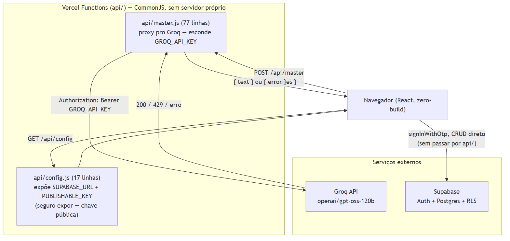
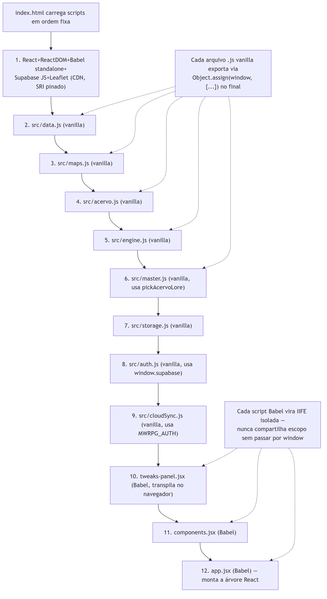

# 1. Introdução

Este documento descreve **como o código é organizado e escrito** — as
duas Vercel Functions que fazem o papel de backend, e o padrão do
frontend zero-build. É complementar ao Documento 05 (Arquitetura da
Solução), que olha para componentes de sistema e infraestrutura, não
para a organização interna do código.

# 2. Backend: duas Vercel Functions, sem servidor próprio

Não existe backend no sentido tradicional (processo próprio, framework
web, banco de conexão persistente) — existem **duas** Vercel Functions
serverless, cada uma resolvendo exatamente um problema de exposição de
segredo.



*Figura 1 — `api/master.js` e `api/config.js`, e o Supabase acessado direto do navegador.*

| Função | Linhas | Problema que resolve |
|---|---|---|
| `api/master.js` | 77 | Esconder `GROQ_API_KEY` — o navegador nunca vê a chave da Groq |
| `api/config.js` | 17 | Expor `SUPABASE_URL`/`SUPABASE_PUBLISHABLE_KEY` — seguro expor, é a chave pública por design do Supabase |

Note a assimetria: `api/master.js` existe porque o segredo real
(`GROQ_API_KEY`) não pode chegar ao cliente; `api/config.js` existe
pelo motivo **oposto** — não é segredo, mas hardcodar a chave pública
direto em `index.html` impediria trocar de projeto Supabase sem novo
deploy de código. Fora essas duas rotas, o Supabase (Auth, CRUD de
`campaign_sessions`) é chamado **direto do navegador** — não passa por
nenhuma API própria, porque Row Level Security no próprio Postgres já
garante o isolamento por usuário (Documento 02, Seção 2).

## 2.1 `api/master.js` — tratamento de erro por status HTTP

```
if (!groqRes.ok) {
  if (groqRes.status === 429) {
    res.status(429).json({ error: 'groq_quota_exceeded', retryAfter: ... });
    return;
  }
  res.status(502).json({ error: 'groq_upstream_error', status: groqRes.status });
}
```

O `429` da Groq vira `429` próprio do MWRPG (não um `502` genérico) —
propaga o status semanticamente correto para o frontend distinguir
"cota estourada" (Documento 03, Seção 4) de qualquer outra falha
upstream.

# 3. Frontend: zero-build, Babel standalone no navegador

Não há `npm install`, não há bundler, não há `package.json` — cada
arquivo `.jsx` é transpilado **no próprio navegador** por
`@babel/standalone` a cada carregamento de página. É uma escolha
deliberada de simplicidade, mantida em todas as fases do projeto,
inclusive quando a complexidade cresceu (o sistema de mapa v0.5,
Leaflet incluso, ainda entrou via `<script>` de CDN, sem build step
novo).



*Figura 2 — Ordem de carregamento de 12 scripts, do CDN ao `app.jsx`.*

## 3.1 Convenção: `Object.assign(window, {...})`

Cada script vanilla (`.js`) termina exportando suas funções/dados via
`Object.assign(window, {...})`; cada consumidor lê de volta via `const
X = window.X` no topo do próprio arquivo. Isso existe porque scripts
`<script type="text/babel">` viram IIFEs separadas depois de
transpilados — sem esse padrão, nada seria compartilhado entre
arquivos. Um anti-padrão crítico documentado em `CLAUDE.md` §6.3:
**nunca** declarar `const styles = {...}` em escopo global de um
arquivo Babel — colide entre arquivos que usam o mesmo nome genérico.

## 3.2 Estado

Não há gerenciador de estado externo (Redux, Zustand, signals) — todo
o estado vive em hooks `useState`/`useRef` de `app.jsx` (381 linhas),
com autosave condicional: nuvem (`MWRPG_CLOUD.saveSession`) quando
logado, `localStorage` (`MWRPG_STORAGE.save`) caso contrário — nunca os
dois ao mesmo tempo.

## 3.3 Design system

Um único tema (variáveis CSS em `:root`, `src/styles.css`, 600 linhas)
com um segundo tema opcional ("Ember", ativado por
`[data-theme="ember"]`) — cores em `oklch()`, tipografia via Google
Fonts (Cinzel/EB Garamond/IM Fell English/IBM Plex Mono), sem emoji na
UI — só 7 glyphs Unicode tipográficos específicos (espada cruzada,
estrela de quatro pontas, escudo, oposição astrológica, seta em laço,
intersecção elétrica, marca de referência), citados por nome aqui
porque a fonte padrão deste gerador de PDF não cobre todos eles — a UI
real do jogo, no navegador, não tem esse problema.

# 4. Peso real do payload inicial (medido, não estimado)

Todo dependência CDN foi medida por download real em 31/08/2026 — não
por número de memória:

| Dependência | Tamanho bruto | Tamanho gzip (transferido) |
|---|---|---|
| React 18.3.1 (dev) | 109.931 bytes | 28.258 bytes |
| ReactDOM 18.3.1 (dev) | 1.080.227 bytes | 232.917 bytes |
| Babel standalone 7.29.0 | 3.137.752 bytes | 653.794 bytes |
| Supabase JS 2.112.4 | 212.426 bytes | 54.632 bytes |
| Leaflet 1.9.4 (JS+CSS) | 162.358 bytes | ~45.983 bytes |
| **Total transferido (gzip)** | — | **~1.015 KB (~1 MB)** |

O Babel standalone sozinho é **64% do payload de dependências** — é o
custo real e mensurável da escolha "zero-build para sempre". Builds de
desenvolvimento do React/ReactDOM (não as de produção, minificadas)
também pesam mais do que precisariam — uma troca só seria possível
introduzindo build step, o que a Frontend Engineer registra
explicitamente como decisão a levar pra assembleia, não a tomar
sozinha (Documento 07, Seção 6).

# 5. Convenções de nomenclatura

Nomes de domínio do jogo (`partyAt`, `mode`, `demoLimit`, textos de UI)
ficam em português ou nomeados no vocabulário do jogo; nomes puramente
técnicos (`useState`, `fetch`, `history`) ficam em inglês, seguindo a
convenção do próprio React/JS. Strings visíveis ao jogador são sempre
português brasileiro (`CLAUDE.md` §13).

# 6. Referências

1. `api/master.js` (77 linhas), `api/config.js` (17 linhas) — lidos integralmente em 31/08/2026.
2. `index.html` (34 linhas) — ordem de carregamento de scripts, lido integralmente em 31/08/2026.
3. `src/app.jsx` (381 linhas), `src/styles.css` (600 linhas) — lidos integralmente em 31/08/2026.
4. Medição real de bytes via `curl` contra unpkg.com/jsdelivr.net, com e sem `Accept-Encoding: gzip`, 31/08/2026.
5. `CLAUDE.md` §6.2-6.3 — convenção de export e anti-padrão de `const styles` global.
6. `.claude/agents/frontend-engineer-mwrpg.md` — trade-off zero-build vs. build step registrado como decisão de assembleia.
