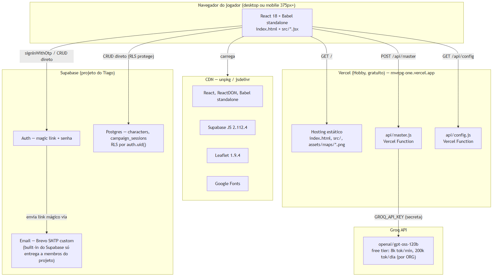

# 1. Introdução

Este documento descreve a arquitetura de **componentes de sistema** do
MWRPG: o que roda onde, como os serviços se conectam, e as decisões de
infraestrutura que moldam o comportamento observável do jogo. Onde o
Documento 04 olha para dentro do código, este documento olha para fora
dele.

# 2. Visão geral de componentes

*Figura 1 — Navegador, CDN, Vercel, Groq e Supabase — quem fala com quem.*

O sistema roda inteiramente no **plano gratuito** de três provedores:
Vercel (hosting estático + 2 Functions), Groq (Mestre IA) e Supabase
(Auth + Postgres). Não há servidor próprio, não há container, não há
processo de longa duração — tudo é ou estático, ou serverless sob
demanda, ou um serviço gerenciado de terceiro.

## 2.1 Por que Vercel, e por que sem cron/hibernação a resolver

Diferente de um serviço com processo próprio (o padrão de risco
identificado em outros projetos do Tiago, ex. Render free hibernando em
15 min de inatividade), o hosting estático da Vercel **não hiberna** —
cada requisição a `index.html`/`src/*` é servida direto, sem "acordar"
nada. As duas Vercel Functions (`api/master.js`, `api/config.js`) são
sob demanda por natureza (cold start de milissegundos, não minutos) —
não existe o mesmo problema estrutural de cold start de 30+ segundos
que aparece em serviços com processo persistente em tier gratuito.

## 2.2 O Supabase built-in email não entrega pra jogadores reais (achado real)

**Contexto real, não hipotético**: o serviço de email embutido do
Supabase (usado para o link mágico de login) **só entrega para membros
da equipe do projeto Supabase**, com teto de **2 emails/hora** —
confirmado na documentação oficial do próprio Supabase, não achismo.
Isso significa que, sem correção, **nenhum jogador de teste real**
(alguém que não é membro do projeto no painel do Supabase) recebe o
email de login. Resolução: SMTP próprio via Brevo (300 emails/dia
grátis, sem cartão, verificação de remetente individual por código de
6 dígitos, sem exigir domínio próprio) — `docs/MANUAL-04-EMAIL-SMTP.md`.
Análise completa das alternativas descartadas no Documento 07, Seção 3.

## 2.3 Site URL apontando para localhost (achado real, corrigido)

Segundo achado real de infraestrutura, distinto do anterior: mesmo com
o SMTP customizado funcionando, o primeiro teste ponta a ponta em
produção (31/08/2026) voltou apontando para `http://localhost:3000`
com erro `otp_expired`/`access_denied` na URL. Causa raiz: o "Site URL"
do painel Supabase (usado como destino padrão sempre que a URL pedida
pelo código não bate com a lista de "Redirect URLs" permitidas)
continuava no valor de fábrica (`localhost:3000`), e a produção
(`mwrpg-one.vercel.app`) não estava na lista de permissões — o
`emailRedirectTo` que o código já passava corretamente
(`src/auth.js`) era silenciosamente ignorado. Corrigido via
`docs/MANUAL-05-URL-CONFIGURATION.md`, sem nenhuma mudança de código
necessária (o código já estava certo). Narrativa completa no Documento
06, Seção 6.

# 3. Segurança

| Mecanismo | Onde | Detalhe verificado no código |
|---|---|---|
| Chave da Groq | `api/master.js` | Só no servidor (env var `GROQ_API_KEY`), nunca chega ao navegador |
| Chave pública do Supabase | `api/config.js` | Exposição deliberada — é a `PUBLISHABLE_KEY`, segura por design do Supabase |
| Isolamento de dado por jogador | `supabase/schema.sql` | RLS (`auth.uid() = user_id`) em `characters` e `campaign_sessions`, `for all using/with check` |
| Senha do jogador | Supabase Auth | Gerenciada inteiramente pelo Supabase — MWRPG nunca vê nem armazena hash próprio |
| Sessão do jogador | Supabase Auth (JWT) | `client.auth.onAuthStateChange` — sessão gerenciada pelo SDK, não por cookie próprio |
| Erros de auth traduzidos | `src/auth.js` | Mapeamento por `error.code` (estável), nunca por texto em inglês que pode mudar entre versões da API |
| Segredos em código | Todo o repositório | Nenhuma chave commitada — `GROQ_API_KEY`, credenciais SMTP e chave de serviço do Supabase só nos respectivos painéis |

# 4. Resiliência

- **Fallback em 3 camadas do Mestre IA**: Groq → `window.claude.complete` → modo offline (Documento 03, Seção 4) — o jogo nunca trava por falta de IA.
- **Cota da Groq esgotada tratada honestamente**: `429` vira mensagem própria, não conta rodada, campanha continua salva (Documento 03, Seção 4).
- **Degradação sem Supabase configurado**: `GET /api/config` retornando 503 (ou rodando local sem backend) faz o jogo cair pro `localStorage` da v0.2 automaticamente — nunca uma tela quebrada.
- **RLS como garantia estrutural**: isolamento de dado por jogador é reforçado no próprio banco, não só checagem em código — mesmo um bug de frontend não vazaria dado de outro usuário.

# 5. Ambientes e configuração

Toda configuração sensível vive em variáveis de ambiente do painel da
Vercel — `GROQ_API_KEY`, `SUPABASE_URL`, `SUPABASE_PUBLISHABLE_KEY` —
nunca em arquivo commitado. `vercel.json` (13 linhas) define Framework
Preset "Other", sem Build Command, Output Directory raiz (`.`) — é HTML
estático puro, sem etapa de build.

# 6. Limite conhecido, sinalizado e ainda sem mitigação

O teto de **200.000 tokens/dia da Groq é por organização inteira**, não
por jogador — com o limite de demo de 40 rodadas e ~700 tokens de saída
por turno, uma campanha completa consome ~60k tokens, o que sustenta
apenas **~3 campanhas completas por dia** se vários jogadores jogarem
até o fim simultaneamente. Isso está sinalizado desde a v0.4
(`CLAUDE.md`) mas **sem mecanismo de proteção agregada** implementado —
é o item de maior prioridade técnica da Assembleia 03 (Documento 07,
Seção 6), ainda pendente de execução.

# 7. Referências

1. `vercel.json` (13 linhas) — lido integralmente em 31/08/2026.
2. `api/master.js`, `api/config.js` — variáveis de ambiente lidas, 31/08/2026.
3. `supabase/schema.sql` — políticas RLS, lidas integralmente em 31/08/2026.
4. Supabase. **Rate limits** (email embutido, 2/hora, só membros do projeto). Acesso em 31/08/2026 — achado que gerou o Manual 04.
5. `docs/MANUAL-05-URL-CONFIGURATION.md` — achado real do Site URL, corrigido em 31/08/2026.
6. `docs/ASSEMBLEIA-02-LLM-GRATUITO-E-BANCO.md` — limite real de tokens/dia da Groq, por organização.
7. `docs/ASSEMBLEIA-03-PERSONAGEM-E-ORCAMENTO.md` — orçamento de token como prioridade não resolvida.
