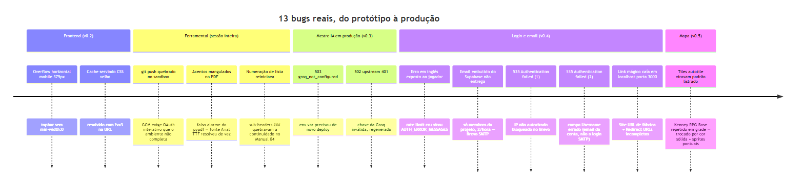

# 1. Introdução

Este é o documento mais longo da série de propósito: é onde a
narrativa real de construção mora — não o que deveria ter acontecido,
mas o que **de fato** aconteceu, incluindo o que quebrou, por que
quebrou, e como foi corrigido. Cada item abaixo tem causa raiz
verificada, não hipótese — quando a causa raiz não foi óbvia de
primeira, isso está registrado também (achados como o das duas causas
distintas de erro 535, Seção 5).

**13 bugs reais documentados**, contados só os de produto — não
inclui os 3 bugs cosméticos encontrados hoje na própria ferramenta de
geração destes documentos (Seção 8, registrados por transparência, mas
fora da contagem por serem de ferramental, não de produto).

*Figura 1 — Os 13 bugs, por fase do projeto.*

# 2. Frontend v0.2: dois bugs de CSS

**Overflow horizontal em mobile (375px)**: os itens flex do topbar não
tinham `min-width:0`, o padrão flexbox de "nunca encolher abaixo do
conteúdo" empurrava a tela pra largura maior que o viewport. Corrigido
com `min-width:0` + `flex-wrap` num bloco `@media (max-width:480px)`,
verificado comparando `scrollWidth === clientWidth` no navegador real
— não assumindo que o CSS estava certo só porque parecia certo no
código.

**Cache do navegador servindo CSS velho**: depois de editar
`styles.css`, o navegador continuava servindo a versão antiga mesmo com
`Ctrl+Shift+R`. Diagnosticado com `fetch(url, {cache: 'no-store'})`
comparando o conteúdo real; corrigido definitivamente com um query
param de versão (`styles.css?v=3`) — invalida o cache do navegador a
cada mudança, sem depender de header de cache do servidor.

# 3. Ferramental: `git push` quebrado no ambiente do agente

**Achado real, persistente por toda a sessão**: o `git push` executado
pelo agente falha consistentemente com `fatal: could not read Username
for 'https://github.com': terminal prompts disabled`, mesmo com
`GCM_INTERACTIVE=never` e `GIT_TERMINAL_PROMPT=0` — o Git Credential
Manager do Windows precisa de uma etapa de OAuth interativa via
navegador que o ambiente sandboxed do agente não consegue completar,
mesmo com o Tiago fisicamente presente e pronto pra autenticar.

**Não é um bug de código** — é uma limitação estrutural do ambiente.
**Workaround estabelecido e seguido a sessão inteira**: o agente sempre
commita localmente e pede explicitamente ao Tiago para rodar `git push`
manualmente. Uma tentativa isolada de push funcionou sem explicação
clara; tratada como não confiável, não como sinal de que o problema
sumiu.

# 4. Mestre IA em produção (v0.3): dois erros de configuração

**`503 groq_not_configured`**: a variável `GROQ_API_KEY` foi adicionada
no painel da Vercel, mas o erro persistiu — causa raiz: a Vercel só lê
variáveis de ambiente novas em builds novos, não retroativamente num
deploy já feito. Corrigido com um redeploy.

**`502 groq_upstream_error status 401`**: depois do redeploy, erro
diferente — a chave colada estava incorreta/inválida. Corrigido
regenerando a chave no painel da Groq e colando com mais cuidado.

# 5. Login e email (v0.4): a cadeia mais longa de depuração real

Esta foi a sequência de bugs mais longa da sessão, com múltiplas causas
raiz distintas descobertas ao vivo, com o Tiago colando logs reais do
painel do Supabase.

## 5.1 Erro em inglês exposto direto ao jogador

O jogador via `"email rate limit exceeded"` cru, em inglês, sem
tradução. Corrigido com `AUTH_ERROR_MESSAGES` (`src/auth.js`) —
mapeamento por `error.code` (recomendação oficial do próprio Supabase,
porque o texto da mensagem pode mudar entre versões da API, mas o
código é estável).

## 5.2 Causa raiz do rate limit: o email embutido do Supabase não é pra usuário final

O rate limit em si era sintoma de uma limitação estrutural mais funda:
o serviço de email **embutido** do Supabase só entrega para **membros
da equipe do projeto**, com teto de 2 emails/hora — confirmado na
documentação oficial, não achismo. Nenhum jogador de teste real
(alguém fora da equipe do painel Supabase) receberia o link, com
qualquer volume. Resolvido com SMTP próprio via Brevo — escolhido sobre
o Resend porque o Resend só permite mandar email pro próprio dono da
conta até verificar um domínio por DNS, e o MWRPG ainda não tem domínio
próprio; o Brevo verifica um remetente individual só com um código de 6
dígitos.

## 5.3 `535 Authentication failed` — duas causas raiz distintas

O mesmo erro de SMTP apareceu duas vezes, por motivos **diferentes** —
registrado separadamente porque tratar como o mesmo bug teria levado a
corrigir a causa errada:

| Ocorrência | Causa raiz | Correção |
|---|---|---|
| 1ª | Brevo bloqueia por padrão IPs não autorizados pra chaves SMTP, e o Supabase não tem IP fixo pra cadastrar | Desativar "Bloquear endereços IP não autorizados" especificamente para chaves SMTP no painel Brevo |
| 2ª | Campo "Username" preenchido com o **email da conta** Brevo, não o **login SMTP** (`...@smtp-brevo.com`) que a própria tela do Brevo mostra | Copiar literalmente o login SMTP exibido, não digitar de memória o email de cadastro |

## 5.4 Link mágico caindo em `localhost` porta 3000

Depois do SMTP funcionar, o primeiro teste ponta a ponta real em
produção voltou apontando para `http://localhost:3000` com
`otp_expired`/`access_denied` na URL. **Causa raiz**: o "Site URL" do
Supabase (destino padrão usado sempre que a URL pedida pelo código não
bate com a lista de "Redirect URLs" permitida) continuava no valor de
fábrica, e a produção não estava nessa lista — o `emailRedirectTo` já
correto no código (`src/auth.js`) era ignorado silenciosamente.
Corrigido 100% no painel do Supabase (`docs/MANUAL-05-URL-CONFIGURATION.md`),
**sem nenhuma mudança de código** — confirmado ao reler `src/auth.js`
antes de mexer em qualquer coisa, pra não corrigir um problema que já
não existia no código.

# 6. Sistema de mapa (v0.5): o pacote de tiles era autotile

**Problema**: os primeiros dois testes de composição do mapa ficaram
ruins. Na 1ª tentativa, tiles decorativos (árvore, porta) com fundo
transparente substituíam diretamente o caractere de terreno na grade em
vez de serem sobrepostos — apareciam como vazios brancos, sem terreno
embaixo. Corrigida essa camada dupla, a 2ª tentativa revelou o problema
real: o pacote Kenney "RPG Base" tem tiles de terreno em estilo
**autotile/blob** (bordas parciais desenhadas pra encaixar com vizinhos
específicos) — repetir qualquer tile de terreno sozinho numa grade cria
um padrão listrado/recortado não intencional. Confirmado gerando e
inspecionando visualmente contact sheets dos tiles candidatos em 2-3x,
não confiando na miniatura oficial pequena do pacote.

**Correção**: abandonado o preenchimento de terreno via sprite,
trocado por cor sólida desenhada via PIL (com leve efeito de xadrez)
para grama/água/terra/piso — os sprites reais do Kenney (CC0) ficaram
só nos elementos discretos e visualmente significativos: prédios,
portas, árvores, props. Proveniência completa em
`docs/MAPAS-PROVENIENCIA.md`.

# 7. Testado, não assumido: o que foi de fato verificado em produção

- Narração real via Groq, incorporando resultado de rolagem de dado corretamente (31/08/2026).
- Fluxo completo de mapa (clique no marcador → interior → saída) — local, desktop e mobile 375px, sem erro de console.
- `GET /api/config` retornando 200 em produção, confirmando Supabase configurado.
- Deploy do build com mapa e senha pós-login confirmado ao vivo (`src/maps.js` retornando 200, texto "JÁ TENHO SENHA" presente na tela).
- Link mágico disparado com sucesso pra `tiago.bocchino@gmail.com` em produção (31/08/2026) — teste ponta a ponta completo (clique real no link, gravação em `campaign_sessions`, contador de rodada) segue pendente no momento em que este documento foi escrito.

# 8. Nota de transparência: bugs encontrados na própria ferramenta de documentação

Fora da contagem de 13 (Seção 1) por serem de ferramental, não de
produto, mas registrados pela mesma disciplina de honestidade:

1. O regex de negrito do conversor `.md`→PDF quebrava quando um trecho
   de código (`` `...` ``) continha `**` literal (ex.: uma URL com
   coringa `/**`) — corrigido protegendo blocos de código com
   placeholder antes de aplicar o regex de negrito.
2. Listas numeradas reiniciavam em "1" quando interrompidas por um
   bloco de código no meio (comum nas seções de consulta individual das
   assembleias) — corrigido usando o número real do primeiro item do
   trecho como `start=` em vez de sempre `1`.
3. Sete glyphs Unicode de design (espada cruzada, estrela, escudo etc.)
   viravam quadrados vazios no PDF — a fonte padrão do gerador não
   cobre esses símbolos. Corrigido citando por nome nos documentos, em
   vez de imprimir o caractere cru (Documento 04, Seção 3.3).

# 9. Referências

1. Histórico completo da sessão de 31/08/2026 (git log, 18 commits) — cada bug corresponde a um ou mais commits reais.
2. `docs/MANUAL-04-EMAIL-SMTP.md` — as duas causas do erro 535, com achado registrado no próprio manual.
3. `docs/MANUAL-05-URL-CONFIGURATION.md` — achado do Site URL, com o código confirmado correto antes da correção.
4. `docs/MAPAS-PROVENIENCIA.md` — técnica final de composição do mapa, tiles usados.
5. Logs reais do painel Supabase (Auth, não Postgres nem Edge — fonte de log correta para esse tipo de erro), colados ao vivo pelo Tiago durante a depuração, 31/08/2026.
6. `src/auth.js` (127 linhas) — `AUTH_ERROR_MESSAGES`, lido integralmente antes e depois da correção do Site URL, confirmando que o código já estava certo.
