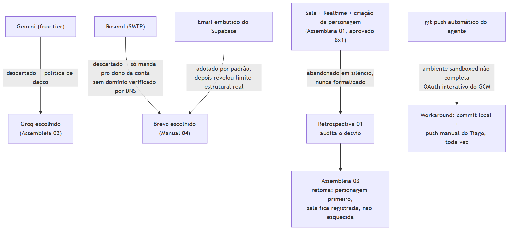

# 1. Introdução

A maior parte da documentação de um projeto registra o que existe. Este
documento registra deliberadamente o **oposto**: as decisões que
levaram algo a **não** existir, ou a existir de forma diferente do
plano original — porque é isso que dá contexto real a quem herdar este
projeto, evitando que a mesma ideia seja reavaliada do zero sem saber
que já foi percorrida.

*Figura 1 — As cinco decisões registradas neste documento.*

# 2. Gemini (free tier) — descartado por política de dados

**Contexto**: na Assembleia 02 (`docs/ASSEMBLEIA-02-LLM-GRATUITO-E-BANCO.md`),
três provedores de LLM gratuito foram pesquisados com fonte citável —
não por memória — antes de escolher qual chamaria o Mestre IA em
produção: Google Gemini, Groq, e OpenRouter (modelos `:free`).

**Por que foi descartado, com a fonte**: o texto oficial da própria
Google (`ai.google.dev/gemini-api/terms`) declara que o tier gratuito
"usa o conteúdo enviado e as respostas geradas para fornecer, melhorar
e desenvolver produtos e serviços Google", com revisão humana — a
camada paga não treina, só a gratuita. Isso tornaria obrigatório avisar
o jogador que o texto criativo/pessoal dele poderia ser lido por um
revisor humano da Google — um custo de confiança real que o AI Master
Engineer classificou como inadequado pra um jogo narrativo onde o
jogador escreve texto livre.

**Escolhido no lugar**: Groq — política verificada como não treinando
com dados de entrada/saída, mesma regra pra conta grátis e paga, com
retenção de 30 dias só por segurança (não por treino).

# 3. Resend — avaliado, descartado em favor do Brevo

**Contexto**: ao resolver a limitação do email embutido do Supabase
(Seção 4), duas opções de SMTP próprio grátis foram avaliadas: Resend e
Brevo.

**Por que o Resend foi descartado**: o Resend só permite mandar email
pro **próprio dono da conta** até verificar um domínio por DNS — e o
MWRPG ainda não tem domínio próprio (`mwrpg-one.vercel.app` não conta
como domínio verificável por DNS pra esse propósito). Isso bloquearia
qualquer jogador de teste real que não fosse o próprio Tiago.

**Escolhido no lugar**: Brevo — permite verificar um remetente
individual (mesmo um endereço `@gmail.com`) só com um código de 6
dígitos enviado pro próprio email, sem exigir domínio. Quando o MWRPG
tiver domínio próprio, autenticar esse domínio no Brevo melhora a
entregabilidade — evolução, não retrabalho (`docs/MANUAL-04-EMAIL-SMTP.md`).

# 4. Email embutido do Supabase — adotado por padrão, depois revertido

Diferente das duas decisões acima (avaliadas com alternativas lado a
lado desde o início), esta foi uma reversão: o Supabase Auth vem, por
padrão, com um serviço de email embutido — foi o que o projeto usou até
o primeiro erro real de rate limit em produção. Só então a causa raiz
apareceu: esse serviço **só entrega para membros da equipe do projeto
Supabase**, com teto de 2/hora — não é sobre volume, é sobre o
mecanismo não existir pra usuário final nenhum. Detalhamento completo
do bug e da correção no Documento 06, Seção 5.2.

# 5. Sala multiplayer, Realtime e criação de personagem — aprovados, depois abandonados em silêncio

**A decisão mais significativa deste documento**, distinta de todas as
outras por um motivo: não foi uma decisão consciente registrada em
lugar nenhum — foi deriva de escopo, descoberta só em retrospecto.

**Contexto**: a Assembleia 01 (`docs/ASSEMBLEIA-01-PLATAFORMA-MULTIPLAYER.md`)
aprovou 8 votos a 1 o Finalista 2 ("Equilíbrio"), com escopo mínimo
explícito: contas por magic link + **criação de personagem** +
**criar/entrar em sala por convite** + **Supabase Realtime** para
sincronização ao vivo + jogar uma sessão multiplayer completa.

**O que de fato foi construído**: login individual solo (consistente
com o magic link aprovado), mas nenhuma sala, nenhum Realtime, e
nenhuma criação de personagem — o jogador segue com a ficha fixa de
`src/data.js`. A tabela `characters` foi criada no schema exatamente
pra essa feature e nunca foi ligada a nada (Documento 02, Seção 2.1).

**Por que isso aconteceu sem decisão formal**: o pedido direto do
Tiago ("temos que fazer login agora... limite de 40 rodadas") foi
implementado direto, sob aprovação geral de "constrói tudo", sem voltar
a consultar os agentes nem reconciliar contra o escopo já aprovado.
Nem uma decisão consciente de abandonar sala, nem um erro de código —
foi o método de planejamento simplesmente não ser seguido por um
período (Documento 01, Seção 6).

**Estado atual**: auditado por completo em
`docs/RETROSPECTIVA-01-DESVIO-DE-METODO.md`, com o método retomado na
`docs/ASSEMBLEIA-03-PERSONAGEM-E-ORCAMENTO.md` — vencedor "personagem
primeiro, sala depois", com sala explicitamente **registrada no
roadmap como adiada por decisão, não mais por esquecimento**.

# 6. `git push` automático — abandonado em favor de workaround manual

**Contexto**: diferente das decisões de produto acima, esta é uma
decisão operacional do próprio processo de trabalho da sessão. O
ambiente sandboxed onde o agente roda não completa a etapa de OAuth
interativo exigida pelo Git Credential Manager do Windows
(`fatal: could not read Username for 'https://github.com': terminal
prompts disabled`), mesmo com múltiplas variáveis de ambiente
diferentes testadas (`GCM_INTERACTIVE=never`, `GIT_TERMINAL_PROMPT=0`).

**Decisão tomada**: em vez de insistir em resolver a autenticação a
cada tentativa, o padrão de trabalho virou fixo — o agente sempre
commita localmente e pede explicitamente que o Tiago rode `git push`.
Funcionou de forma confiável a sessão inteira (18 commits, todos
pedidos explicitamente); uma tentativa isolada de push do próprio
agente funcionou sem explicação clara, tratada como exceção não
confiável, não como sinal de que o problema estava resolvido.

# 7. Nota: o que este documento não repete

O achado do Site URL apontando pra `localhost` (Documento 05, Seção
2.3; Documento 06, Seção 5.4) não entra aqui como "decisão" porque não
foi uma — foi um valor de configuração de fábrica que ninguém definiu
conscientemente, corrigido assim que descoberto. Fica só nos
documentos de arquitetura/prática, para não duplicar sem necessidade.

# 8. Referências

1. `docs/ASSEMBLEIA-02-LLM-GRATUITO-E-BANCO.md` — comparativo Gemini/Groq/OpenRouter com fonte, linhas 25-41.
2. Google. **Gemini API Additional Terms of Service**. <https://ai.google.dev/gemini-api/terms>. Citação direta usada na decisão.
3. `docs/MANUAL-04-EMAIL-SMTP.md` — comparação Resend vs. Brevo, decisão registrada.
4. `docs/ASSEMBLEIA-01-PLATAFORMA-MULTIPLAYER.md` — escopo aprovado 8×1, Seção 6.
5. `docs/RETROSPECTIVA-01-DESVIO-DE-METODO.md` — auditoria completa do desvio de escopo.
6. `docs/ASSEMBLEIA-03-PERSONAGEM-E-ORCAMENTO.md` — retomada do método, vencedor e mitigações.
7. Histórico de tentativas de `git push` da sessão de 31/08/2026 — erro consistente registrado.
