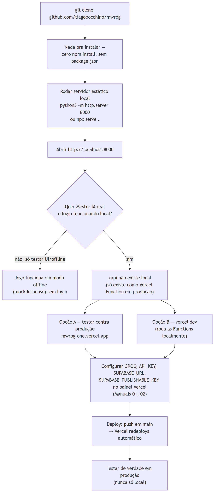

# 1. Introdução

Guia prático para rodar o MWRPG localmente e continuar o
desenvolvimento — não repete o manual de configuração de cada painel
externo (Groq, Supabase, Vercel, Brevo), que já existem em
`docs/MANUAL-01` a `docs/MANUAL-05` com passo a passo detalhado; aqui é
o roteiro de alto nível de onde cada peça se encaixa.

# 2. Rodando local



*Figura 1 — Do clone ao primeiro turno jogado, com ou sem backend.*

Não há `npm install` — o projeto é zero-build (Documento 04, Seção 3).
Qualquer servidor estático serve:

```
git clone https://github.com/tiagobocchino/mwrpg.git
cd mwrpg
python3 -m http.server 8000
# ou: npx serve .
```

Abra `http://localhost:8000`. Sem mais nenhuma configuração, o jogo já
funciona em **modo offline** (respostas guiadas sem IA, sem login) —
degradação graciosa por design (Documento 03, Seção 4).

## 2.1 Limitação real: `/api` não existe fora da Vercel

`api/master.js` e `api/config.js` só rodam como Vercel Functions — um
servidor estático simples (`python -m http.server`) não serve rotas
`/api/*`. Duas opções pra testar o Mestre IA/login localmente:

- **Testar direto contra produção** (`mwrpg-one.vercel.app`) — mais
  simples, é o que foi usado durante toda a sessão de construção.
- **`vercel dev`** — roda as Functions localmente também, exige CLI da
  Vercel instalada e autenticada; não testado nesta sessão.

# 3. Variáveis de ambiente (painel da Vercel)

| Variável | Usada em | Onde conseguir |
|---|---|---|
| `GROQ_API_KEY` | `api/master.js` | console.groq.com — `docs/MANUAL-01-GROQ.md` |
| `SUPABASE_URL` | `api/config.js` | painel Supabase, Project Settings → API — `docs/MANUAL-02-SUPABASE.md` |
| `SUPABASE_PUBLISHABLE_KEY` | `api/config.js` | mesmo painel — é a chave **pública**, segura de expor (Documento 05, Seção 3) |

**Nunca commitar nenhuma delas** — só colar no painel da Vercel.
Adicionar/trocar uma variável exige um **novo deploy** pra ser lida
(achado real, Documento 06, Seção 4) — salvar no painel sozinho não
basta se o deploy já existia.

# 4. Banco de dados (Supabase)

Rodar `supabase/schema.sql` **uma vez** no SQL Editor do painel do
projeto — cria `characters` e `campaign_sessions` com RLS. Não há
Alembic nem sistema de migração formal; qualquer mudança de schema
futura precisa de um novo `ALTER TABLE` aplicado manualmente (mesmo
padrão de simplicidade do resto do projeto).

# 5. Email de login (obrigatório pra testers reais)

O serviço de email embutido do Supabase **não funciona pra jogadores
reais** (Documento 06, Seção 5.2) — é obrigatório configurar SMTP
próprio via Brevo antes de convidar qualquer pessoa de fora pra testar.
Passo a passo completo: `docs/MANUAL-04-EMAIL-SMTP.md`.

**Depois** disso, confirmar Site URL e Redirect URLs no painel
Authentication → URL Configuration do Supabase — sem isso o link
mágico redireciona pra `localhost` mesmo em produção (achado real,
Documento 06, Seção 5.4): `docs/MANUAL-05-URL-CONFIGURATION.md`.

# 6. Deploy

Já configurado: projeto `mwrpg` na Vercel, conectado a
`tiagobocchino/mwrpg`, deploy automático a cada push em `main`.
`vercel.json` (13 linhas) já define Framework Preset "Other", sem
Build Command, Output Directory raiz.

**Limitação conhecida do ambiente do agente**: `git push` executado
pelo próprio agente falha de forma consistente (Documento 07, Seção
6) — o padrão adotado é sempre commitar local e pedir que um humano
com acesso interativo ao GitHub rode o push manualmente.

# 7. Checklist de verificação antes de considerar algo "pronto"

Seguindo a disciplina do próprio projeto (`docs/METODO-PLANEJAMENTO.md`,
regra do fluxo encadeado):

1. Testar localmente primeiro (se a feature não depende de `/api`).
2. Commit → push (manual) → aguardar o redeploy da Vercel.
3. Testar de verdade **em produção**, nunca só local — inclusive
   sessões de múltiplos turnos seguidos, não só "abre e faz uma ação"
   (regra que pegou bugs reais em outros projetos do Tiago).
4. Testar em viewport mobile (375px) além de desktop.
5. Atualizar `CLAUDE.md`/`README.md`/manual relevante em `docs/` antes
   de considerar a tarefa encerrada.

# 8. Referências

1. `vercel.json`, `package.json` (inexistente, confirmando zero-build) — verificado em 31/08/2026.
2. `docs/MANUAL-01-GROQ.md` a `docs/MANUAL-05-URL-CONFIGURATION.md` — passo a passo completo de cada painel externo.
3. `supabase/schema.sql` — 64 linhas, schema completo.
4. `docs/METODO-PLANEJAMENTO.md` — regra do ciclo commit→push→produção→documentação.
