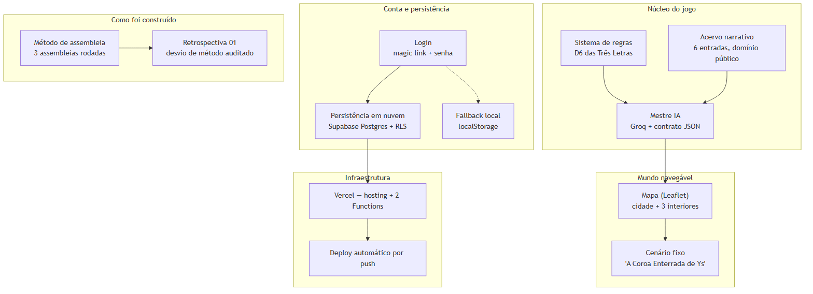

# 1. Visão executiva

O MWRPG é um RPG de mesa solo narrativo, conduzido por um Mestre IA:
o jogador comanda um aventureiro marcado pelo selo de Ys, acompanhado
de três NPCs companheiros fixos, num cenário de fantasia bretã
low-magic. Chat central com opções numeradas, sistema de regras leve
(2d6 + atributo), mapa interativo com duas escalas, e login por
email — 100% gratuito, rodando inteiramente em planos free de três
provedores (Vercel, Groq, Supabase).

*Figura 1 — As cinco áreas funcionais do sistema, e como foi construído.*

Este é o 10º de 11 documentos da série de documentação completa do
projeto (a Seção 6 traz o índice de todos). Este documento em
particular é a síntese: reúne o essencial de cada um dos outros dez e
serve como ponto de entrada para quem quiser entender o projeto
inteiro sem ler os onze.

# 2. O que existe hoje (resumo por área)

| Área | Estado | Documento de referência |
|---|---|---|
| Mestre IA (narração) | Em produção real via Groq, testado com narração incorporando rolagem de dado | Docs 01, 03, 05 |
| Sistema de regras (D6 das Três Letras) | Estável desde o protótipo, 40 linhas, não mudou de fórmula | Docs 01, 03, 08 |
| Login e persistência | Magic link + senha opcional funcionando; teste ponta a ponta do primeiro link real ainda pendente no momento deste documento | Docs 01, 02, 06 |
| Mapa com duas escalas | Implementado (Leaflet + Kenney CC0), testado localmente (desktop + mobile 375px) | Docs 01, 02, 06 |
| Criação de personagem | **Não existe** — ficha fixa, tabela `characters` provisionada e morta no banco | Docs 02, 07 |
| Sala multiplayer / Realtime | **Não existe** — aprovado na Assembleia 01, nunca construído, adiado por decisão registrada na Assembleia 03 | Doc 07 |
| Método de planejamento | Seguido nas Assembleias 01/02/03; teve um hiato real entre a 02 e a retomada, auditado com honestidade | Docs 01, 07 |

# 3. Linha do tempo e números reais

Construído majoritariamente num único dia (31/08/2026), 18 commits no
total — 1 é o protótipo original de 08/05/2026; dos outros 17, **7
tocam código de aplicação** e **11 são de documentação/processo**
(manuais, assembleias, retrospectiva — inclusive esta própria série).

| Métrica | Valor |
|---|---|
| Commits totais | 18 (1 de 08/05, 17 de 31/08) |
| Linhas de código de aplicação (`src/`, `api/`, `supabase/`) | 2.272 |
| Tabelas no banco | 2 (`characters` morta, `campaign_sessions` ativa) |
| Testes automatizados | 0 — toda validação é manual, contra produção real |
| Bugs reais documentados (produto) | 13 |
| Decisões de escopo descartadas/revertidas | 4 (Gemini, Resend, email embutido do Supabase, sala/Realtime/personagem) + 1 workaround operacional (`git push` manual) |
| Assembleias multiagente rodadas | 3 |
| Agentes especialistas no roster | 10 |
| Manuais passo a passo produzidos | 5 |
| Entradas do acervo narrativo de domínio público | 6 |
| Variáveis de ambiente de configuração | 3 |
| Peso total de dependências CDN (gzip) | ~1.015 KB (~1 MB), 64% só o Babel standalone |

O detalhamento fase a fase está no Documento 01 (fluxos) e no
Documento 06 (narrativa prática, com os bugs).

# 4. Arquitetura em uma página

Um único hosting estático (Vercel Hobby, sem hibernação) com duas
Vercel Functions serverless fazendo o papel de backend — uma esconde
a chave da Groq, a outra expõe a chave pública do Supabase. O jogo
fala direto com o Supabase (Auth + Postgres com RLS) sem API própria
no meio; o Mestre IA passa pela função serverless porque a chave da
Groq precisa ficar escondida. Detalhes completos no Documento 05.

Limite conhecido, sinalizado mas ainda sem mitigação implementada: o
teto de 200.000 tokens/dia da Groq é por organização inteira, não por
jogador — com o limite de demo atual, sustenta só ~3 campanhas
completas por dia se vários jogadores terminarem simultaneamente
(Documento 05, Seção 6; Documento 07, Seção 5, é a prioridade nº1 da
Assembleia 03).

# 5. O que aconteceu de mais importante, em uma frase por documento

- **Doc 01**: o projeto inteiro foi construído num único dia, 31/08/2026.
- **Doc 02**: a tabela `characters` existe desde a v0.4 e nunca foi usada — evidência morta de um escopo abandonado.
- **Doc 03**: o sistema usa 2d6 (não 1d20) de propósito — a curva favorece "sucesso parcial" como desfecho mais comum.
- **Doc 04**: o Babel standalone sozinho é 64% do payload de dependências — o custo real, medido, do zero-build.
- **Doc 05**: dois achados reais de infraestrutura corrigidos ao vivo — email do Supabase que não entrega, e o Site URL apontando pra localhost.
- **Doc 06**: 13 bugs reais, cada um com causa raiz verificada — incluindo dois erros idênticos (`535`) com duas causas totalmente diferentes.
- **Doc 07**: sala multiplayer e criação de personagem foram aprovadas 8×1 na Assembleia 01 e nunca construídas — sem que ninguém tivesse decidido isso conscientemente, até a auditoria.
- **Doc 08**: o `CRS.Simple` do Leaflet é o uso teoricamente correto da biblioteca fora do seu domínio geográfico nativo.
- **Doc 09a**: `git push` automático do agente não funciona neste ambiente — todo push desta sessão foi manual.
- **Doc 09b**: o jogador nunca precisa saber que existe Groq, Supabase, ou JSON — só que o mestre às vezes "precisa de um instante de silêncio".

# 6. Índice da série completa

| # | Documento | Foco |
|---|---|---|
| 01 | Modelo Lógico do Projeto | Fluxos em Mermaid — turno, login, mapa, método |
| 02 | Modelo Relacional | Banco real (2 tabelas) + estruturas do cliente |
| 03 | Modelos Técnicos de Metodologia | O "como" de cada técnica aplicada |
| 04 | Engenharia da Solução | Backend serverless e frontend zero-build, por dentro |
| 05 | Arquitetura da Solução | Componentes, integrações, segurança, resiliência |
| 06 | Documentação Prática de Implementação | 13 bugs reais, causa raiz de cada um |
| 07 | Documentação Lógica de Construção | O que foi descartado/revertido, e por quê |
| 08 | Documentação Teórica da Construção | Por que cada técnica é a escolha certa |
| 09a | Guia Técnico | Setup, variáveis de ambiente, deploy |
| 09b | Guia do Usuário | Manual do jogador, sem jargão |
| 10 | Documentação Completa (este) | Síntese executiva de tudo acima |

# 7. Estado exato do projeto no fim desta sessão (31/08/2026)

**Em produção, confirmado**: site no ar, build mais recente servido
(mapa + senha pós-login confirmados via requisição real a
`src/maps.js` retornando 200 e texto "JÁ TENHO SENHA" presente na
tela), `/api/config` respondendo 200, link mágico disparado com
sucesso pra `tiago.bocchino@gmail.com`.

**Pendente do Tiago no momento em que esta série foi escrita**:

1. Rodar `git push` pra sincronizar os commits mais recentes (Manual
   05, Retrospectiva 01, Assembleia 03, e esta própria série de
   documentação) — nenhum deles chegou a `origin/main` ainda.
2. Clicar o link mágico real que já foi enviado, pra fechar o teste
   ponta a ponta (sessão autenticada, gravação em `campaign_sessions`,
   contador de rodada avançando).
3. Aprovar (ou não) o plano da Assembleia 03 — "personagem primeiro,
   sala depois", com o orçamento de token da Groq como bloqueio
   explícito antes de qualquer novo convite de teste.

**Próximo passo natural, quando a sessão for retomada**: depois do
push e da confirmação do login, a prioridade nº1 (por votação 6-2-1 na
Assembleia 03) é destravar o fluxo de criação de personagem — a
tabela já existe no banco (Documento 02, Seção 2.1), só falta o
formulário e a ligação. Em paralelo, ou logo antes de convidar
qualquer novo tester, resolver o mecanismo de proteção do orçamento de
token da Groq (Documento 05, Seção 6) — os dois já têm dono definido
na assembleia (Backend/Frontend/Game System Designer para personagem;
AI Master Engineer para o orçamento), só falta a implementação em si,
que segue não iniciada por decisão explícita — aguardando aprovação do
Tiago antes de qualquer código, como manda o próprio método.

# 8. Referências

Ver as referências específicas em cada um dos 10 documentos anteriores
— este documento sintetiza, não reintroduz fontes primárias novas.
